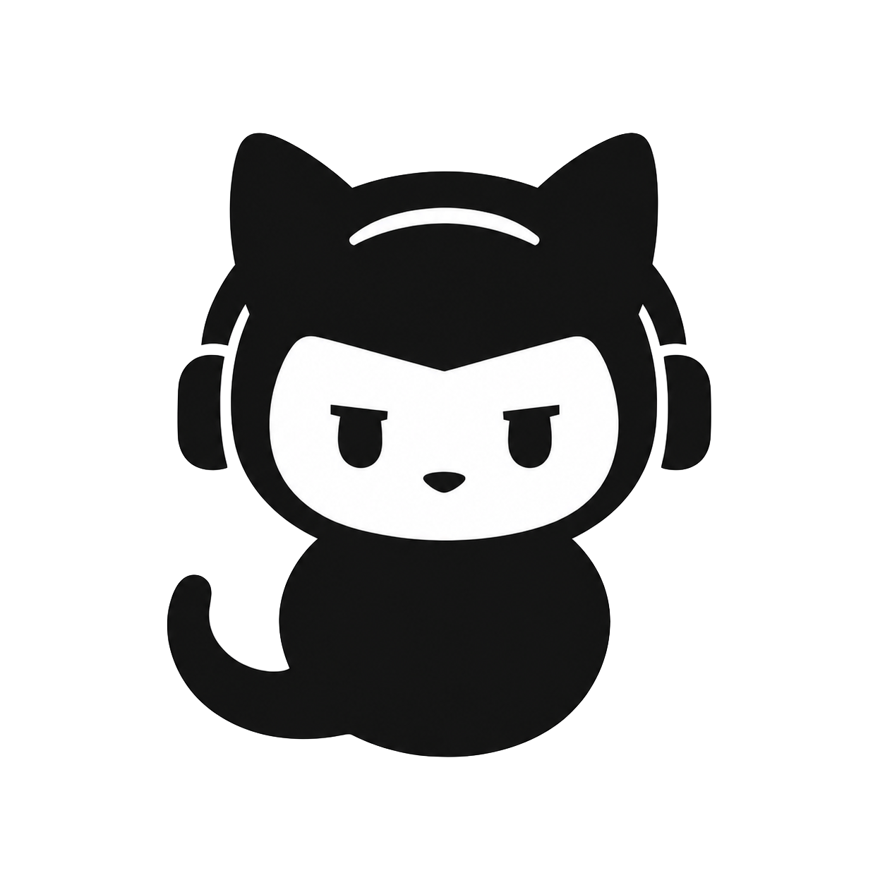

<p align="center">
  
</p>

<h1 align="center">GithuBro</h1>

<p align="center">
  A minimal, self-hosted worker that turns labelled GitHub issues into pull requests.
</p>

GithuBro watches selected repositories for open issues labelled `agent`. At each
polling tick, it selects at most one issue, creates a clean temporary checkout,
and asks the [pi coding agent](https://github.com/earendil-works/pi) to implement
the requested change or review an existing pull request.

GitHub itself is the state store: labels act as the state machine, while
structured issue comments form a durable event log. No database or persistent
worktree is required.

## How it works

Each run consists of four phases:

1. **Poll:** Find the oldest eligible issue across all configured repositories.
2. **Setup:** Lock the issue, post a start message, clone the repository, and
   prepare the correct branch and issue context.
3. **Agent run:** Invoke pi in headless RPC mode. A background worker posts
   heartbeat comments during long-running tasks.
4. **Cleanup:** Reconstruct the outcome from GitHub, transition labels, and
   remove the temporary checkout.

GithuBro supports three deterministic modes:

| Mode | Condition | Behaviour |
|---|---|---|
| `fresh` | No open matching PR exists | Create a new `agent/<issue>-<slug>` branch and PR |
| `revision` | An open PR exists and newer user feedback is present | Continue on the existing PR branch |
| `self-audit` | An open PR exists without newer feedback | Review and, if necessary, repair the existing implementation |

Only Phase 3 invokes the language model. An idle polling tick consumes no model
tokens.

## Requirements

- Linux host with Docker
- GitHub Personal Access Token with `repo` permissions
- Model-provider credentials supported by pi
- The following labels in every watched repository:
  - `agent`
  - `agent-in-progress`
  - `agent-done`

## Quickstart

Clone the repository and create the environment file:

```bash
git clone https://github.com/oliverruoff/githubro.git
cd githubro
cp .env.example .env
```

At minimum, configure:

```dotenv
GITHUB_PAT=ghp_replace_me
GITHUB_REPOS=owner/repository,owner/another-repository
PI_ARGS=--model openai/gpt-5
OPENAI_API_KEY=replace_me
```

Then deploy:

```bash
chmod +x deploy.sh
./deploy.sh
```

Add the `agent` label to an open issue. With the default configuration, the
worker picks it up at the next local quarter-hour boundary (`00`, `15`, `30`, or
`45`).

## Configuration

All runtime configuration is provided through `.env`.

### Required

| Variable | Description |
|---|---|
| `GITHUB_PAT` | GitHub PAT used for issues, comments, branches, and pull requests |
| `GITHUB_REPOS` | Comma-separated repositories in `owner/repo` format |

### GitHub workflow

| Variable | Default | Description |
|---|---|---|
| `GITHUB_USERNAME` | `oliverruoff` | User mentioned in issue notifications |
| `GITHUB_LABEL_TRIGGER` | `agent` | Queued-work label |
| `GITHUB_LABEL_IN_PROGRESS` | `agent-in-progress` | Active-run lock label |
| `GITHUB_LABEL_DONE` | `agent-done` | Successful-run label |
| `GITHUB_BASE_BRANCH` | `main` | Base branch for fresh work |
| `GITHUB_PR_TARGET` | Value of `GITHUB_BASE_BRANCH` | Pull-request target branch |

### Agent and scheduling

| Variable | Default | Description |
|---|---|---|
| `PI_ARGS` | Unset | Additional pi arguments, especially `--model provider/model` |
| `BRO_REASONING_EFFORT` | `medium` | Reasoning level: `low`, `medium`, or `high` |
| `BRO_POLL_INTERVAL_SECONDS` | `900` | Polling interval; production runs remain quarter-hour aligned |
| `BRO_HEARTBEAT_INTERVAL_SECONDS` | `1200` | Interval between heartbeat comments |
| `BRO_HEARTBEAT_STALE_AFTER_SECONDS` | `2700` | Age after which an interrupted run is recovered |
| `BRO_RUN_TIMEOUT_SECONDS` | `5400` | Hard timeout for one pi run |
| `BRO_LOG_LEVEL` | `INFO` | `DEBUG`, `INFO`, `WARNING`, or `ERROR` |

Provider credentials such as `OPENAI_API_KEY` or `ANTHROPIC_API_KEY` are passed
through to pi and are never validated or persisted by GithuBro.

## Label lifecycle

```text
agent
  └─ picked up ──> agent-in-progress
                       ├─ success/audit passed ──> agent-done
                       └─ clarification/error ───> agent
```

`agent-in-progress` is the distributed lock. If a container stops during an
agent run, the next worker detects stale runner activity, posts a recovery
comment, removes leftover temporary worktrees, and re-queues the issue.

To request another pass after a successful run, remove `agent-done` and add
`agent` again. New feedback selects revision mode; otherwise GithuBro performs a
self-audit.

## Comment protocol

Comments are both notifications and restart-safe state evidence:

- `[githubro:runner]` identifies deterministic start, heartbeat, recovery, and
  infrastructure messages.
- `[githubro:agent][outcome:success]` records a completed implementation.
- `[githubro:agent][outcome:clarification]` records a question that requires
  user input.
- `[githubro:agent][outcome:audit-passed]` records a successful self-audit with
  no code changes required.

Every issue comment ends with the configured `@GITHUB_USERNAME` mention so that
GitHub sends a notification.

## Agent instructions and skills

The system-level agent contract lives in [`AGENTS.md`](AGENTS.md). It is copied
to `/root/.pi/agent/AGENTS.md` during the image build. Changes therefore take
effect after the next deployment.

Additional pi skills can be placed below `skills/` before rebuilding the image.

## Development

Run the Python tests:

```bash
python -m pytest -q
```

Type-check the pi extensions:

```bash
cd extensions
npm install
npx tsc --noEmit
```

Build the container locally:

```bash
docker build --build-arg "CACHEBUST=$(date +%s)" -t github-bro:latest .
```

## Operations and troubleshooting

Inspect the worker logs:

```bash
docker logs -f githubro
```

Common problems:

- **The container exits immediately:** Check required environment variables and
  `docker logs githubro` for a configuration error.
- **An issue is not selected:** Confirm it is open, carries `agent`, belongs to a
  configured repository, and is not protected by a fresh `agent-in-progress`
  heartbeat.
- **A run appears stuck:** It is recovered after
  `BRO_HEARTBEAT_STALE_AFTER_SECONDS`; restarting the container does not lose the
  GitHub-backed run state.
- **pi cannot authenticate:** Verify `PI_ARGS` and the selected provider's API
  key in `.env`.
- **GitHub operations fail:** Ensure the PAT can read issues and comments, edit
  labels, push branches, and create or update pull requests.

GithuBro deliberately does not auto-merge pull requests, run issues in parallel,
send external notifications, or expose a web server.
